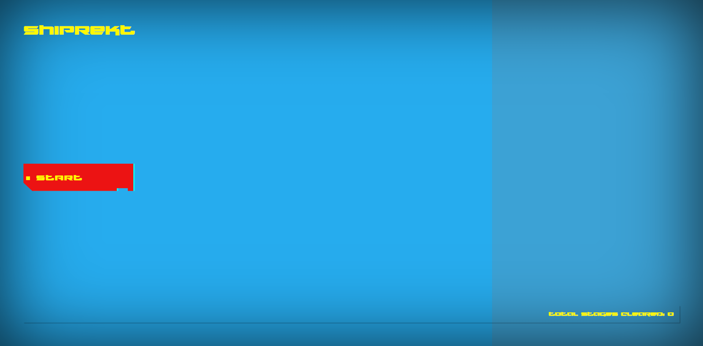

# ShipRekt

## About The Game

ShipRekt is a 3D top-down rogue-lite space punk “Sword and Space” game.  
You are a space sailor who has been shipwrecked and boarded by pirates.
You must fight your way through the ship to expropriate your enemy's ship and escape.

## Inspiration

* [Binding of Isaac](https://store.steampowered.com/app/113200/The_Binding_of_Isaac/)
* [Void Bastards](https://store.steampowered.com/app/857980/Void_Bastards/)
* [Enter the Gungeon](https://store.steampowered.com/app/311690/Enter_the_Gungeon/)

## Roadmap

* [x] Basic movement
* [x] Basic combat
* [x] Basic enemy AI
* [x] Basic level/scene generation
* [x] Basic UI
* [ ] Instructions
* [ ] Basic inventory
* [ ] Basic item generation
* [ ] Basic loot system
* [ ] Basic shop system
* [ ] Basic leveling system
* [ ] Character customization
* [ ] Map system
* [ ] In scene room transitions
* [ ] Scene randomization
* [ ] Bosses
* [ ] Scene artistic design

## Pictures

 

## Recordings

https://user-images.githubusercontent.com/47361643/210447268-b1c963e8-a2eb-4eb0-af7d-2fb8a790639a.mp4

 

https://user-images.githubusercontent.com/47361643/210134323-b2275114-da36-4dab-ba12-d4346d2f487c.mp4

 

https://user-images.githubusercontent.com/47361643/210134509-16319d9f-43b6-46dc-a287-744cc43e14bb.mp4

 

https://user-images.githubusercontent.com/47361643/210108127-ba2a49e2-3790-4bea-be47-9836bc8b2572.mp4

 

https://user-images.githubusercontent.com/47361643/210107541-0c8c7d19-e6aa-4d96-9fec-5da9b1c38ca6.mp4

 

https://user-images.githubusercontent.com/47361643/210107583-722745b1-552b-492c-98d6-b99dd66df069.mp4

 

https://user-images.githubusercontent.com/47361643/210107592-913fdf91-4c3a-4168-8808-dd2ceb112a91.mp4

 

https://user-images.githubusercontent.com/47361643/210107601-1d4adc82-106c-4434-9048-148c479a7f20.mp4

 

https://user-images.githubusercontent.com/47361643/210107628-f2f99064-6013-4b5a-a646-f87cb1cf3b00.mp4

 

## License

[MIT licensed](./LICENSE).
